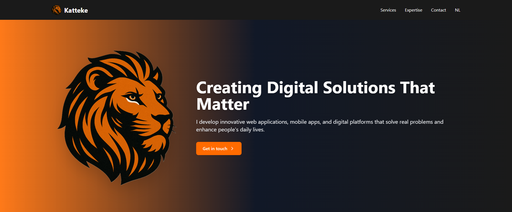

# Katteke - Advanced AI & Software Solutions
Katteke - Geavanceerde AI & Software Oplossingen

Welcome to the official repository of [Katteke](https://www.katteke.tech), where I specialize in artificial intelligence, machine learning, and innovative software solutions.

Welkom bij de officiële repository van [Katteke](https://www.katteke.tech), waar ik gespecialiseerd ben in kunstmatige intelligentie, machine learning en innovatieve software-oplossingen.

## About Katteke | Over Katteke

I am a sole proprietorship ("eenmanszaak") registered in The Netherlands, focusing on cutting-edge AI/ML solutions and software development. I deliver sophisticated applications that leverage the power of artificial intelligence to solve complex problems and create innovative solutions.

Ik ben een eenmanszaak geregistreerd in Nederland, gericht op geavanceerde AI/ML-oplossingen en softwareontwikkeling. Ik lever geavanceerde applicaties die de kracht van kunstmatige intelligentie benutten om complexe problemen op te lossen en innovatieve oplossingen te creëren.

## What I Offer | Wat Ik Aanbied

- **AI & Machine Learning | AI & Machine Learning**: Custom AI solutions, machine learning models, and intelligent automation | Op maat gemaakte AI-oplossingen, machine learning modellen en intelligente automatisering
- **SaaS Development | SaaS Ontwikkeling**: Scalable cloud-based software solutions with AI integration | Schaalbare cloud-gebaseerde softwareoplossingen met AI-integratie
- **Custom Software | Maatwerk Software**: Bespoke applications, web platforms, and mobile solutions | Op maat gemaakte applicaties, webplatforms en mobiele oplossingen

## Technologies | Technologieën

This website showcases my technical expertise using modern technologies:

Deze website demonstreert mijn technische expertise met moderne technologieën:

- **AI/ML Stack**: Advanced machine learning frameworks and AI technologies | Geavanceerde machine learning frameworks en AI-technologieën
- **Frontend**: React 18 with TypeScript | React 18 met TypeScript
- **Cloud & SaaS**: Scalable cloud architecture and SaaS solutions | Schaalbare cloud-architectuur en SaaS-oplossingen
- **Development**: Full-stack development with modern tools and practices | Full-stack ontwikkeling met moderne tools en praktijken
- **Internationalization | Internationalisatie**: Built-in support for English and Dutch | Ingebouwde ondersteuning voor Engels en Nederlands
- **Security**: GDPR-compliant data handling and protection | AVG-conforme gegevensverwerking en bescherming

## Expertise | Expertise

- 🤖 Artificial Intelligence & Machine Learning | Kunstmatige Intelligentie & Machine Learning
- ☁️ SaaS & Cloud Solutions | SaaS & Cloud Oplossingen
- 💻 Custom Software Development | Maatwerk Softwareontwikkeling
- 📱 Web & Mobile Applications | Web & Mobiele Applicaties
- 🔒 Secure & Scalable Architecture | Veilige & Schaalbare Architectuur
- 🌐 International Reach | Internationale Reikwijdte

## Visit Me | Bezoek Mij

Discover how I can transform your ideas into intelligent, scalable solutions at [www.katteke.tech](https://www.katteke.tech)

Ontdek hoe ik uw ideeën kan transformeren in intelligente, schaalbare oplossingen op [www.katteke.tech](https://www.katteke.tech)

## Contact | Contact

Ready to leverage AI for your project? Let's discuss:
Klaar om AI in te zetten voor uw project? Laten we het bespreken:

- 📧 Email | E-mail: katteke@protonmail.com
- 🐦 Twitter | Twitter: [@Kattekke](https://x.com/Kattekke)

## License | Licentie

© 2025 Katteke. All rights reserved. | Alle rechten voorbehouden.
